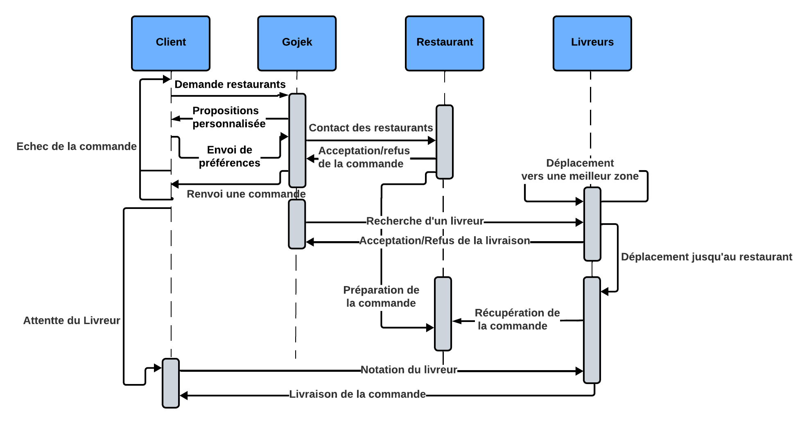
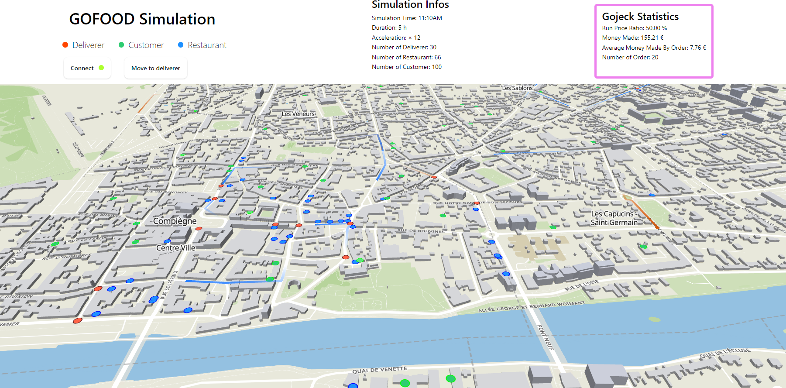

# Projet de Simulation GOFOOD

## Présentation du projet

Le projet simule, en se basant sur une ville réelle et ses informations. Il a pour but de simuler **le montant gagné par Gojek**, un service de commande et de livraison de nourriture similaire à Uber Eat et Deliveroo.

Pour cela, le projet simule les interactions entre clients, livreurs et gojek. Les agents communiquent ensemble pour atteindre leurs buts. Pour cela, il  est nécessaire que des commandes soient effectuées par les clients et qu'elles soient menées à terme. De plus amples informations sont disponibles dans le fichier PDF.



 <p xmlns:cc="http://creativecommons.org/ns#" xmlns:dct="http://purl.org/dc/terms/"><span property="dct:title">GOFood</span> is licensed under <a href="https://creativecommons.org/licenses/by-nc-sa/4.0/?ref=chooser-v1" target="_blank" rel="license noopener noreferrer" style="display:inline-block;">CC BY-NC-SA 4.0</a></p> 
 
Les agents implémentent l'interface Agent. L'ensemble des agents tourne dans sa propre boucle de simulation éxécutée dans une goroutine indépendante. Les agents communiquent entre eux au travers de sync.Map et de channels. Les interactions entre agents telles qu'implémentées correspondent au diagramme ci-dessus.

## Exemple d'éxécution


## Documentation du projet

La documentation est centralisée dans le dossier doc. Il contient:

- Des diagrammes montrant les comportements des agents
- Une description de l'implémentation de chaque type agent et leurs fonctions clés.
- Des captures d'écrans et des vidéos.

## Comment lancer le projet

1. **Démarrer le serveur web :**
   Naviguez vers le répertoire `web` et démarrez un serveur HTTP simple avec Python :
   ```sh
   cd /ia04-gofood/web
   python3 -m http.server
   ```
   Ouvrez votre navigateur et allez à [localhost:8000](http://localhost:8000).

2. **Démarrer la simulation :**
   Naviguez vers le répertoire du projet et lancez le serveur Go :
   ```sh
   cd /ia04-gofood/projetGo/cmd/demo/
   go run test.go
   ```

   Le fichier test.go dispose de plusieurs fonctions de test qui font varier les parametres de la simulation, il suffit de changer la fonction appellée dans le main pour changer de simulation.

3. **Connecter l'interface web au backend :**
    Sur l'interface utilisateur cliquer sur le bouton *Connect*, un indicateur vert confirme la connection à la simulation. 

## Légende de l'interface



### Chemins des livreurs et mises à jour en temps réel

Il existe trois types de chemins différents représentés par trois couleurs:
- Orange lorsqu'un livreur se replace a un meilleur endroit
- Bleu lorsqu'un livreur se déplace vers un restaurant pour retirer une commande
- Vert lorsqu'un livreur se déplace vers le client pour le livrer

Chaque type de chemin de livreur est enregistré avec des coordonnées et des timestamps. Pour animer les livreurs en temps réel, le client doit connaître l'heure exacte à laquelle ils atteindront le nœud suivant, même s'il ne l'ont pas encore atteint afin que TripsLayer affiche correctement les livreurs qui avancent.

### Comportement des chemins des livreurs

Lorsque l'on *hover* un livreur ou que l'on clique sur le bouton *Move to deliverer*, son dernier itinéraire est mis en évidence sur la carte. Pour que l'utilisateur puisse étudier le chemin, il ne disparait pas et reste affiché. Cependant si l'on clique quelque part sur le chemin on peut le faire disparaitre. Survoler un autre livreur mettra à jour les chemins mis en évidence pour le nouveau livreur.

## Fonctionnement technique de l'interface utilisateur

Des visualisations sont disponible dans le dossier `images` et `videos`.

### Communication via WebSockets

Le projet utilise des WebSockets pour communiquer entre le serveur et le client. Les données sont échangées au format JSON. La connexion WebSocket est établie dans le fichier JavaScript (`index.js`), et le serveur envoie différents types de messages pour mettre à jour l'état du jeu.

### Visualisation de la carte

La visualisation de la carte est réalisée avec Mapbox et Deck.gl. Différentes couches sont utilisées pour représenter divers éléments sur la carte :
- **TripsLayer :** Utilisée pour les livreurs en mouvement.
- **PathLayer :** Utilisée pour les chemins empruntés par les livreurs.
- **IconLayer :** Utilisée pour les destinations.
- **ScatterplotLayer :** Utilisée pour les agents immobiles: les clients, les restaurants et les livreurs inactifs.

### Visualisation des statistiques en direct de la simulation

La visualisation des statistiques est réalisée avec Chart.js. Lorsque le backend envoi des nouvelles statistiques un nouveau point est créé sur le graphique. Toutes les statistiques sont sur le même graphique en même temps mais on peut ne pas toute les visualiser en même temps en cachant certaines valeurs. Pour cela il suffit de cliquer au dessus du graph sur la valeur que l'on souhaite dissimuler.

### Connexion WebSocket et gestion des messages

La connexion WebSocket est établie dans le fichier `index.js`. La fonction `updateGame` gère différents types de messages reçus du serveur :

- **init :** Initialise la simulation avec les informations comme l'acceleration et le nombre d'agents.
- **totalStatistics :** Met à jour les statistiques totales de la simulation.
- **statistics :** Met à jour le graphique avec les dernières statistiques.
- **restaurants :** Crée et met à jour les restaurants sur la carte.
- **customers :** Crée et met à jour les clients sur la carte.
- **deliverers :** Met à jour les positions et les chemins des livreurs.
